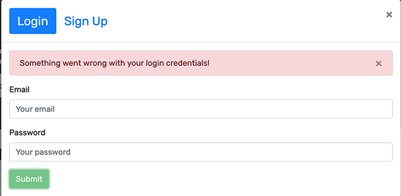

# Google Book Search Engine 

## Description

The Google Book Search Engine is refactored from a application that was originally built with a RESTful API. It has been rebuilt as a GraphQL API using Apollo Server. With Google Book Search, a user can search for books and save them for later use. The user can also remove books from their saved list once they are no longer needed. The user is presented with the results of their search that includes an image (if available), the title of the book, and a brief description (if one is available). 

Utilizes the following technologies:
  * HTML
  * JavaScript
  * CSS
  * REACT.js
  * Express.JS
  * Apollo Server
  * GraphQL
  * MongoDB
---

## Table of Contents 

[Usage](#usage) 

[License](#license) 

[Contributors](#contributors) 

[Tests](#tests) 

[Questions](#Questions) 

---

## Usage

My files can be accessed in the repository [HERE](https://github.com/arcangyl1963/googlebooks-search-app) 

The image below shows the repository where my project files are located: 

 

The deployed web application can be viewed [HERE](https://googlebooks-search-app.herokuapp.com/). 

The images below show the Google Book Search Engine features in use: 

The main page shows the navbar, a search field with a 'Submit Search' button, and instructs the user to 'search for a book to begin'. 

 

Entering a book title, topic, or keyword will return up to 10 matching results. 

 

The search results will display book cards with images (if available), the book title, the author's name, and descriptions. The is a button to save the book at the bottom. If a book has already been saved, the button is deactivated and the label reads 'This book has already been saved'. 

 

The user must login in order to save books to their list. If the user doesn't have an account, they must first signup. The user will enter a username, email address, and a password. If the email already exists and has already been used to signup, then an error message is displayed. 
Signup screen                                   |   Signup screen with error message
:----------------------------------------------:|:----------------------------------:                
 |    

The Login screen requires the user to enter the email address and password entered at signup. If the email does not exist or an incorrect password is entered, then an error message is displayed. 
Login Screen                                    |   Login screen with error message
:----------------------------------------------:|:---------------------------------:                
 |    

Once successfully logged in, the navbar options will change with 'See your books' and 'Logout' navigation links added. 

 

The Saved Books page will display the book cards of all the books the user has saved. The 'Save this book' button is replaced with a 'Delete this book' which removes the book from the user's saved list when clicked. 
Saved Books Page                                  |  Saved Books Detail
:------------------------------------------------:|:---------------------------------------------------:
 |  

## License: 

 This software is licensed under an MIT license:  Copyright © 2021 Arcangyl Studios  Permission is hereby granted, free of charge, to any person obtaining a copy of this software and associated documentation files (the 'Software'), to deal in the Software without restriction, including without limitation the rights to use, copy, modify, merge, publish, distribute, sublicense, and/or sell copies of the Software, and to permit persons to whom the Software is furnished to do so, subject to the following conditions: The above copyright notice and this permission notice shall be included in all copies or substantial portions of the Software. THE SOFTWARE IS PROVIDED 'AS IS', WITHOUT WARRANTY OF ANY KIND, EXPRESS OR IMPLIED, INCLUDING BUT NOT LIMITED TO THE WARRANTIES OF MERCHANTABILITY, FITNESS FOR A PARTICULAR PURPOSE AND NONINFRINGEMENT. IN NO EVENT SHALL THE AUTHORS OR COPYRIGHT HOLDERS BE LIABLE FOR ANY CLAIM, DAMAGES OR OTHER LIABILITY, WHETHER IN AN ACTION OF CONTRACT, TORT OR OTHERWISE, ARISING FROM, OUT OF OR IN CONNECTION WITH THE SOFTWARE OR THE USE OR OTHER DEALINGS IN THE SOFTWARE. 

---

## Contributors: 

James Harris 

---

## Tests: 

There were no test scripts created for this application. 

---

## Questions: 

- Feel free to email me with any questions about this project at: arcangyl@gmail.com 

 

- My GitHub profile may be viewed by clicking [here](https://github.com/arcangyl1963).

© 2021 arcangyl studios